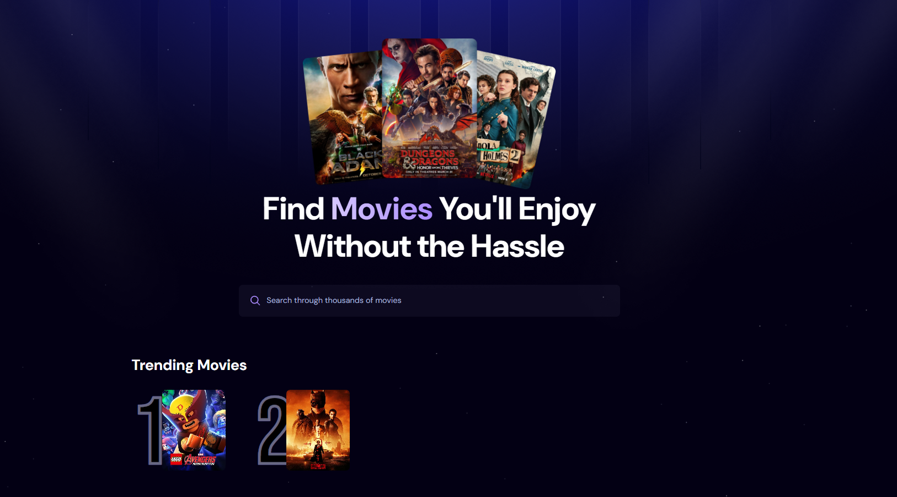

# 🎬 React Movie App

A modern, responsive movie discovery application built with React and Vite, allowing users to search and explore information about their favorite movies.



## 🌐 Live Demo

Visit [React Movie App](https://react-movio.netlify.app/) to see the platform in action!

## ✨ Features

- 🔍 Search movies by title
- 🎞️ Browse popular and trending movies
- 📱 Responsive design for all devices
- ⚡ Fast and smooth user experience with Vite
- 🎨 Modern and clean UI with beautiful movie cards

## 🚀 Getting Started

### Prerequisites

- Node.js (v14 or later)
- npm or yarn

### Installation

1. Clone the repository:
   ```bash
   git clone https://github.com/yourusername/react-movie-app.git
   cd react-movie-app
   ```

2. Install dependencies:
   ```bash
   npm install
   # or
   yarn
   ```

3. Start the development server:
   ```bash
   npm run dev
   # or
   yarn dev
   ```

4. Open [http://localhost:5173](http://localhost:5173) in your browser.

## 🛠️ Built With

- [React](https://reactjs.org/) - JavaScript library for building user interfaces
- [Vite](https://vitejs.dev/) - Next Generation Frontend Tooling
- [TMDB API](https://www.themoviedb.org/documentation/api) - For movie data
- [React Icons](https://react-icons.github.io/react-icons/) - Popular icons for React projects

## 📝 License

This project is licensed under the MIT License - see the [LICENSE](LICENSE) file for details.

## 🙏 Acknowledgments

- Movie data provided by [The Movie Database (TMDB)](https://www.themoviedb.org/)
- Built with ❤️ using Create React App
